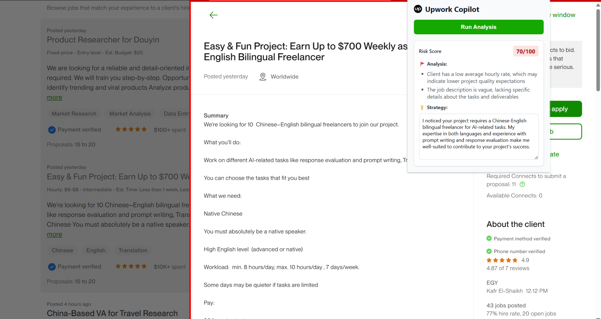

# 🛡️ Upwork Copilot (AI Risk Detector)

**Upwork Copilot** is a Chrome Extension powered by Python and AI designed to help freelancers spot "Red Flag" clients instantly. It analyzes job descriptions, extracts hidden financial stats, and drafts strategic proposal hooks.


*(Note: Please add a screenshot of the extension running to an 'assets' folder)*

---

## ✨ Features

- **🚩 Risk Audit**: Automatically detects scams (e.g., "Telegram" requests), low budgets, and bad reviews.
- **💰 Financial X-Ray**: Extracts "Total Spent" and "Avg Hourly Rate" even from complex UI layouts.
- **🧠 AI Strategy**: Uses LLMs (GLM-4/OpenAI) to draft a specific "Hook" based on the job's pain points.
- **🔒 Smart Focus**: Automatically detects and locks onto the active Upwork slider window.

---

## 🛠️ Tech Stack

- **Backend**: Python (FastAPI, Uvicorn)
- **Frontend**: Chrome Extension (Manifest V3, Vanilla JS)
- **AI Engine**: Zhipu AI (GLM-4) / Compatible with OpenAI

---

## 🚀 Quick Start (Local Setup)

### 1. Backend Setup

Navigate to the `backend` directory and install dependencies:

```bash
cd backend
pip install -r requirements.txt